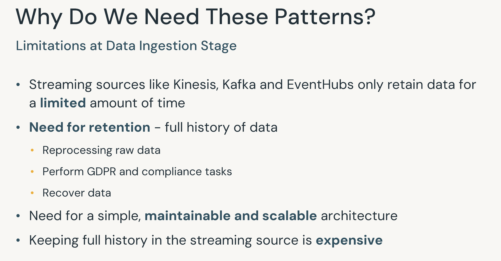
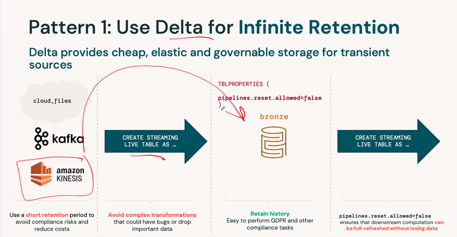
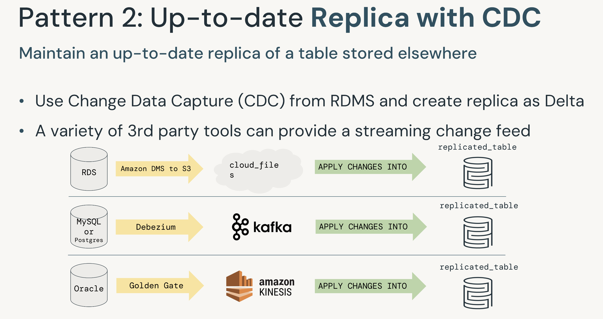
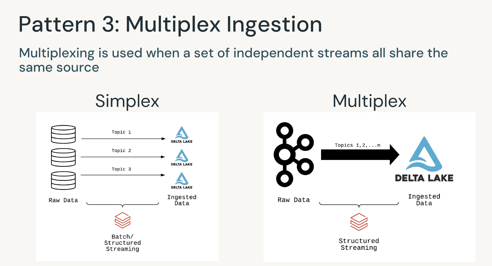
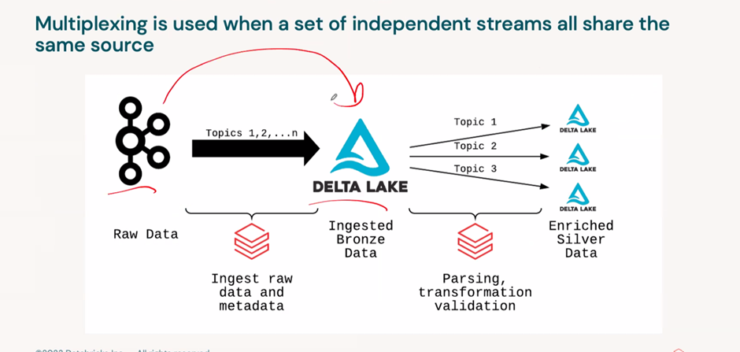

# Data Ingestion Patterns with Delta Lake and Apache Spark Structured Streaming


## Delta for infinite ingestion

To expand on data ingestion patterns, particularly using Delta for infinite ingestion, you can leverage Delta Lake's integration with Apache Spark Structured Streaming. This allows you to handle continuous data streams efficiently. Here are some key points and a sample implementation:

### Key Points

- **Delta Lake Integration**: Delta Lake is deeply integrated with Spark Structured Streaming, enabling efficient streaming reads and writes.
- **Exactly-Once Processing**: Delta Lake ensures exactly-once processing, even with multiple streams or concurrent batch jobs.
- **Efficient File Discovery**: Delta Lake efficiently discovers new files when using files as the source for a stream.
- **Streaming Source and Sink**: You can use Delta tables both as a source and a sink for streaming data.

### Sample Implementation

#### Setting Up a Delta Table as a Streaming Source

You can load a Delta table as a stream source and use it in a streaming query. This query will process all existing data in the table and any new data that arrives after the stream starts.

```python
from pyspark.sql.functions import col
import pyspark.sql.functions as F

# Define the schema for the incoming data
schema = "user_id INT, workout_id INT, timestamp FLOAT, action STRING, session_id INT"

# Read from a Delta table as a streaming source
streaming_df = (
    spark.readStream
         .format("delta")
         .load("/path/to/delta/table")
)

# Process the streaming data
processed_streaming_df = (
    streaming_df
        .select("user_id", "workout_id", F.col("timestamp").cast("timestamp").alias("time"), "action", "session_id")
        .withWatermark("time", "30 seconds")
        .dropDuplicates(["user_id", "time"])
)

# Write the processed data to another Delta table
query = (
    processed_streaming_df
        .writeStream
        .format("delta")
        .outputMode("append")
        .option("checkpointLocation", "/path/to/checkpoint/dir")
        .start("/path/to/output/delta/table")
)

query.awaitTermination()
```

### Explanation

- **Schema Definition**: Define the schema for the incoming data.
- **Reading Stream**: Use `readStream` to read from a Delta table.
- **Processing Stream**: Apply transformations such as casting, watermarking, and deduplication.
- **Writing Stream**: Use `writeStream` to write the processed data to another Delta table, ensuring continuous ingestion.

### Slide from Class



#### Importance of `pipelines.reset.allowed = False` in Delta for Infinite Ingestion

The configuration `pipelines.reset.allowed = False` is important in the context of using Delta for infinite ingestion because it prevents the accidental or unauthorized resetting of Delta Live Tables (DLT) pipelines. Here are the key reasons why this setting is crucial:

#### Key Reasons

- **Data Integrity**: Preventing resets ensures that the data pipeline maintains its state and continuity. Resetting a pipeline can lead to data loss or duplication, which can compromise the integrity of the ingested data.

- **Operational Stability**: By disallowing resets, you ensure that the pipeline runs continuously without interruptions. This is particularly important for infinite ingestion scenarios where the pipeline is expected to handle a continuous stream of data.

- **Security**: Restricting the ability to reset the pipeline adds an additional layer of security. It ensures that only authorized personnel can perform such critical operations, reducing the risk of malicious or accidental disruptions.

- **Compliance and Auditing**: In environments with strict compliance requirements, maintaining a consistent and auditable data pipeline is essential. Disallowing resets helps ensure that the pipeline's operational history is preserved, aiding in compliance and auditing efforts.

By setting `pipelines.reset.allowed = False`, you ensure that the Delta Live Tables pipeline operates in a secure, stable, and continuous manner, which is essential for effective and reliable infinite data ingestion.

## Pattern2 Up to date Replica with CDC



### Creating a Replica of a Database Using Change Data Capture (CDC)

Creating a replica of a database using Change Data Capture (CDC) is a strategic approach for several reasons, particularly when using Databricks for streaming data ingestion. Here are the key advantages and why a company might invest in duplicating their RDBMS:

### Key Advantages of Using CDC for Database Replication

#### Real-Time Data Synchronization

- **Continuous Updates**: CDC captures changes (inserts, updates, deletes) in real-time, ensuring that the replica is always up-to-date with the source database.
- **Low Latency**: This real-time synchronization allows for low-latency data access, which is crucial for applications requiring the most current data.

#### Operational Efficiency

- **Offloading Workloads**: By replicating the database, you can offload read-heavy operations (like analytics and reporting) to the replica, reducing the load on the primary database and improving its performance.
- **Scalability**: This setup allows for better scalability as the read and write operations can be distributed across multiple databases.

#### Disaster Recovery and High Availability

- **Failover Capabilities**: An up-to-date replica can serve as a failover in case the primary database goes down, ensuring business continuity.
- **Data Redundancy**: Having a replica provides data redundancy, which is a critical component of disaster recovery strategies.

#### Enhanced Analytics and Reporting

- **Dedicated Analytics Environment**: Replicating the database to a separate environment allows for complex queries and analytics without impacting the performance of the transactional database.
- **Real-Time Insights**: With CDC, the analytics environment is always current, enabling real-time insights and decision-making.

#### Geographical Distribution

- **Reduced Latency for Global Users**: Replicating the database to different geographical locations can reduce latency for users by serving data from the nearest replica.
- **Compliance with Data Residency Requirements**: Some regions have strict data residency requirements, and having replicas in specific locations can help comply with these regulations.

### Why Databricks Recommends This Pattern

#### Integration with Delta Lake

- **Efficient Data Processing**: Delta Lake's integration with Structured Streaming allows for efficient and reliable data ingestion and processing.
- **Incremental Data Loading**: Delta Lake supports incremental data loading, which is ideal for CDC scenarios where only changes need to be processed.

#### Unified Batch and Streaming

- **Simplified Development**: Databricks provides a unified API for both batch and streaming data, simplifying the development and maintenance of data pipelines.
- **Delta Live Tables**: Databricks recommends using Delta Live Tables for streaming or incremental ETL tasks, providing a managed and optimized environment for building reliable data pipelines.

#### Scalability and Performance

- **Optimized for Large-Scale Data**: Databricks is built on Apache Spark, which is designed to handle large-scale data processing, making it suitable for high-throughput and low-latency streaming applications.

### Implementation Example

To enable CDC on a SQL Server database, you can use the following commands:

```sql
-- Enable CDC on the database
USE <database-name>
EXEC sys.sp_cdc_enable_db

-- Enable CDC on a specific table
EXEC sys.sp_cdc_enable_table
    @source_schema = N'dbo',
    @source_name = N'<table-name>',
    @role_name = NULL
```

For Amazon RDS for SQL Server, the command is slightly different:

```sql
-- Enable CDC on the database in Amazon RDS
EXEC msdb.dbo.rds_cdc_enable_db '<database-name>'
```

### Conclusion

Investing in a CDC-based replica of your database using Databricks for streaming ingestion offers numerous benefits, including real-time data synchronization, operational efficiency, disaster recovery, enhanced analytics, and geographical distribution. These advantages can significantly outweigh the costs, providing a robust and scalable data infrastructure.

## Pattern3  Multiplex Ingestion: Benefits and Use Cases with Databricks


Simplex/Multiplex.
-Don’t Use Kafka as Bronze Table. Its expensive to keep full history.

Multiplex Model




Multiplex ingestion refers to the ability to ingest data from multiple sources simultaneously into a unified data platform. Databricks offers robust support for this through its integration with Apache Spark Structured Streaming and Delta Lake. Here are the key benefits and use cases of multiplex ingestion using Databricks:

### Benefits of Multiplex Ingestion on Databricks

#### Unified Data View

- **Consolidation**: Databricks allows you to aggregate data from various sources into a single, unified view, making it easier to analyze and derive insights.
- **Consistency**: Ensures data consistency across different sources, providing a single source of truth.

#### Real-Time Processing

- **Low Latency**: Databricks supports near real-time data ingestion and processing, which is crucial for applications requiring immediate insights.
- **Timely Decision-Making**: Facilitates timely decision-making by providing up-to-date information.

#### Scalability and Performance

- **Optimized for Large-Scale Data**: Built on Apache Spark, Databricks is designed to handle large-scale data processing, making it suitable for high-throughput and low-latency streaming applications.
- **Auto Loader**: Databricks recommends using Auto Loader for most streaming operations from cloud object storage, which simplifies the ingestion process and optimizes performance.

#### Operational Efficiency

- **Simplified Architecture**: Reduces the complexity of data pipelines by centralizing ingestion processes.
- **Cost-Effective**: Optimizes resource usage and reduces operational costs by consolidating multiple ingestion processes.

#### Flexibility

- **Diverse Data Sources**: Databricks supports a wide range of data sources, including databases, streaming platforms, file systems, and APIs.
- **Adaptability**: Easily adapts to new data sources and changing data requirements.

### Use Cases for Multiplex Ingestion on Databricks

#### Real-Time Analytics

- **Financial Services**: Ingesting data from trading systems, market feeds, and customer transactions to provide real-time analytics and risk management.
- **Retail**: Combining data from point-of-sale systems, online transactions, and inventory management for real-time sales analytics and inventory optimization.

#### IoT and Sensor Data

- **Smart Cities**: Aggregating data from various sensors (traffic, weather, pollution) to provide real-time monitoring and decision-making.
- **Manufacturing**: Ingesting data from industrial IoT devices for real-time monitoring, predictive maintenance, and process optimization.

#### Customer 360

- **Marketing**: Combining data from CRM systems, social media, web analytics, and customer support to create a comprehensive view of customer behavior and preferences.
- **Healthcare**: Integrating patient data from electronic health records (EHR), wearable devices, and lab systems to provide a holistic view of patient health.

#### Fraud Detection

- **Banking**: Ingesting transaction data, user behavior logs, and external threat intelligence feeds to detect and prevent fraudulent activities in real-time.
- **E-commerce**: Monitoring transactions, user activities, and payment gateways to identify and mitigate fraud.

#### Supply Chain Management

- **Logistics**: Aggregating data from transportation management systems, warehouse management systems, and supplier networks to optimize supply chain operations.
- **Manufacturing**: Ingesting data from suppliers, production lines, and distribution centers to ensure efficient supply chain management.

### Conclusion

Databricks offers a powerful platform for multiplex ingestion, leveraging Apache Spark Structured Streaming and Delta Lake to provide real-time data processing, scalability, and operational efficiency. This enables organizations to build robust and scalable data architectures that meet the demands of modern data-driven applications.

---

Feel free to ask if you need more details or have any other questions!

 